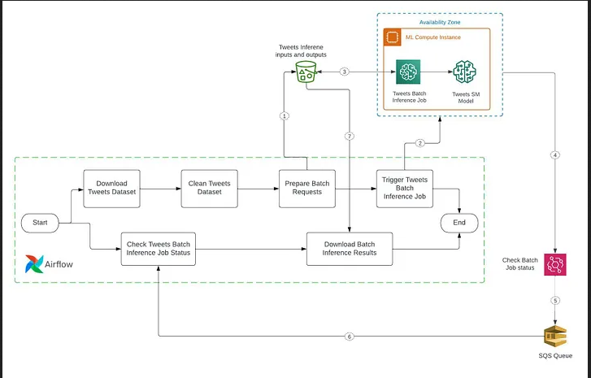

# Deploying a HuggingFace BERT Model on SageMaker #

## Overview ##

This README provides step-by-step instructions on deploying a HuggingFace BERT model on Amazon SageMaker for batch inference using a data pipeline orchestrated by Apache Airflow.

## Prereqs ##
1. SageMaker Model: Upload our trained model here.
2. AWS Account: Make sure you have an AWS account with the necessary permissions to create and manage SageMaker resources.
3. EC2 Instance: Set up an EC2 instance with the Ubuntu AMI, with at least 4 CPU cores and 16 GB RAM.
4. IAM Role: Create an IAM role with the following permissions and attach it to your EC2 instance:
   - AmazonEC2FullAccess
   - AmazonSQSFullAccess
   - AmazonS3FullAccess
   - AmazonSageMakerFullAccess
  

## Installing Apache Airflow in EC2

### 1. Updating and install packages
```
sudo apt-get update
sudo apt install python3-pip
sudo pip install pandas apache-airflow
```
### 2. Run Airflow

```
airflow standalone
```
Access the Airflow UI using your EC2 instance's public IPv4 DNS on port 8080 (e.g., http://<Public IPv4 DNS>:8080/home).

### 3. Configure Airflow
Set up the Airflow connection to your AWS account and configure DAGs as described .



## Deploying the model

### Prepare model for deployment
- Create a HuggingFace BERT model using the provided script.
```
 
from sagemaker.pytorch import PyTorchModel

role = get_execution_role()
model_path = "s3://your-s3-bucket/path/to/model/artifacts/"

# Create a PyTorchModel
model = PyTorchModel(model_data=model_path, role=role, framework_version='1.8.1', py_version='py3', entry_point='inference.py', source_dir='code/')

```
- Create SageMaker Model:
```
from sagemaker import get_execution_role
from sagemaker.pytorch import PyTorchModel

role = get_execution_role()
model_path = "s3://your-s3-bucket/path/to/model/artifacts/"

# Create a PyTorchModel
model = PyTorchModel(model_data=model_path, role=role, framework_version='1.8.1', py_version='py3', entry_point='inference.py', source_dir='code/')
```
- Deploy SageMaker Model:
```
predictor = model.deploy(instance_type='ml.m5.large', endpoint_name='your-endpoint-name')
```
- Make Predictions:
```
result = predictor.predict({'input': 'your_input_data'})
print(result)
```
- Clean up:
Remember to delete the SageMaker endpoint when done to avoid unnecessary charges.
```
predictor.delete_endpoint()
```


   


